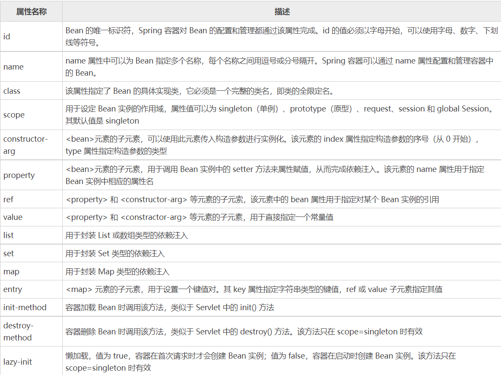
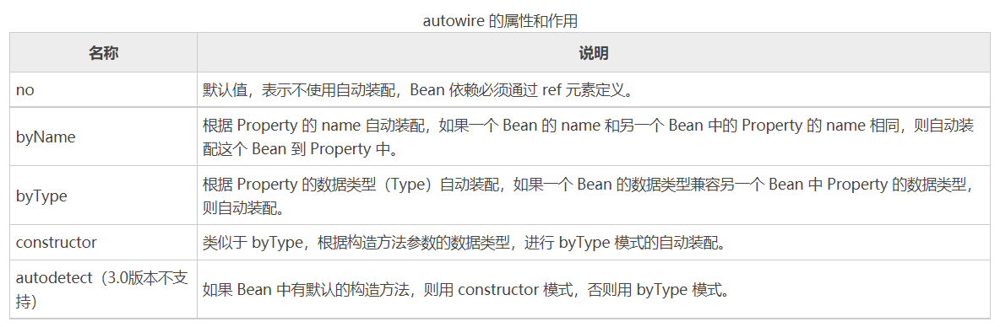

# IOC

## 一. bean配置

### 1. beans.xml

```xml
<?xml version="1.0" encoding="UTF-8"?>
<beans xmlns="http://www.springframework.org/schema/beans"
       xmlns:xsi="http://www.w3.org/2001/XMLSchema-instance"
       xsi:schemaLocation="http://www.springframework.org/schema/beans
   http://www.springframework.org/schema/beans/spring-beans-3.0.xsd">
    <bean  name="hello" id="helloWorld" class="com.hu.pojo.Hello">
        <property name="name" value="Hello World!" />
        <property name="size" value="20"/>
    </bean>
</beans>
```



### 2. import

用于合并配置

```xml
<?xml version="1.0" encoding="UTF-8"?>
<beans xmlns="http://www.springframework.org/schema/beans"
       xmlns:xsi="http://www.w3.org/2001/XMLSchema-instance"
       xsi:schemaLocation="http://www.springframework.org/schema/beans
   http://www.springframework.org/schema/beans/spring-beans-3.0.xsd">
    <import resource="beans.xml"/>
    <import resource="beans1.xml"/>
</beans>
```

测试：

```java
import com.hu.pojo.Hello;
import com.hu.pojo.User;
import org.junit.Test;
import org.springframework.context.support.ClassPathXmlApplicationContext;

public class MyTest {
    @Test
    public void testBeans(){
        ClassPathXmlApplicationContext context = new ClassPathXmlApplicationContext("application.xml");
        Hello hello = (Hello) context.getBean("hello");
        hello.say();
        User user = (User) context.getBean("user");
        System.out.println(user.getAge());
    }
}
```


## 二. DI依赖注入

### 1. 构造器创建对象

```xml
<!--  参数名  -->
<bean class="com.hu.pojo.User" id="user">
    <constructor-arg name="id"  value="01"/>
</bean>
```

```xml
<!-- 参数类型-->
<bean class="com.hu.pojo.User" id="user">
    <constructor-arg type="int" value="01"/>
    <constructor-arg type="java.lang.String" value="你爹"/>
    <constructor-arg type="int" value="20"/>
</bean>
```

### 2.setter创建对象

```xml
<bean id="user" class="com.hu.pojo.User">
    <property name="age" value="20"/>
    <property name="name" value="老王"/>
    <property name="id" value="01"/>
 </bean>
```

### 3.特殊类型注入

```xml
<beans>
    <bean id="address" name="address" class="com.hu.pojo.Address">

        <property name="address" value="你家"/>
    </bean>
    <bean id="s01" name="s01;s1;student01" class="com.hu.pojo.Student">
        <!--      普通注入      -->
        <property name="name" value="老王"/>
        <!--     参考注入       -->
        <property name="address" ref="address"/>
        <!--      数组注入      -->
        <property name="books">
            <array>
                <value>计算机网络</value>
                <value>高级程序设计</value>
                <value>数据结构与算法</value>
            </array>
        </property>
        <!--     列表注入       -->
        <property name="hobbies">
            <list>
                <value>看书</value>
                <value>编程</value>
                <value>打游戏</value>
            </list>
        </property>
        <!--      map注入       -->
        <property name="card">
            <map>
                <entry key="PID" value="10201031"/>
                <entry key="CID" value="0121212"/>
            </map>
        </property>
        <!--      set注入       -->
        <property name="game">
            <set>
                <value>LOL</value>
                <value>GOG</value>
                <value>GTA</value>
                <value>RDR</value>
            </set>
        </property>
        <!--     null注入       -->
        <property name="wife">
            <null/>
        </property>
        <!--     属性注入       -->
        <property name="info">
            <props>
                <prop key="username">ddac</prop>
                <prop key="password">asdasd</prop>
            </props>
        </property>
    </bean>
</beans>
```

### 4. c/p 命名注入

用于简化 注入

```xml
<!--  c:标签构造器注入  -->
<bean class="com.hu.pojo.User" name="u02;u2;user2" id="user2" c:age="20" c:name="liu" c:id="02"/>
<!--  p标签setter注入  -->
<bean class="com.hu.pojo.User" id="user3" name="u3;user3" p:age="18" p:id="03" p:name="李"/>
```

注意使用c/p标签命名注入在xml头中添加声明

```xml
xmlns:p="http://www.springframework.org/schema/p"
xmlns:c="http://www.springframework.org/schema/c"
```

### 5.bean作用域

#### 1）singleton

默认值，单例模式，表示在 Spring 容器中只有一个 Bean 实例，Bean 以单例的方式存在。（Spring5默认作用域）

#### 2）prototype

原型模式，表示每次通过 Spring 容器获取 Bean 时，容器都会创建一个 Bean 实例。

#### 3）request

每次 HTTP 请求，容器都会创建一个 Bean 实例。该作用域只在当前 HTTP Request 内有效。

#### 4）session

同一个 HTTP Session 共享一个 Bean 实例，不同的 Session 使用不同的 Bean 实例。该作用域仅在当前 HTTP Session 内有效。

#### 5）application

同一个 Web 应用共享一个 Bean 实例，该作用域在当前 ServletContext 内有效。

类似于 singleton，不同的是，singleton 表示每个 IoC 容器中仅有一个 Bean 实例，而同一个 Web 应用中可能会有多个 IoC 容器，但一个 Web 应用只会有一个 ServletContext，也可以说 application 才是 Web 应用中货真价实的单例模式。

#### 6）websocket

websocket 的作用域是 WebSocket ，即在整个 WebSocket 中有效。

使用 scope=

```xml
<bean class="com.hu.pojo.User" id="user" scope="prototype">
```

### 6.自动装配Autowired



#### 6.1 xml装配

普通方式装配

```xml
<bean id="cat" class="com.hu.pojo.Cat" p:name="littleWhite"/>
<bean id="dog" class="com.hu.pojo.Dog" p:name="littleBlack"/>
<bean name="me" id="self" class="com.hu.pojo.Human"
      p:cat-ref="cat" p:name="laowang" p:dog-ref="dog"/>
```

自动装配

```xml
<bean id="cat" class="com.hu.pojo.Cat" p:name="littleWhite"/>
<bean id="dog" class="com.hu.pojo.Dog" p:name="littleBlack"/>
<!--  autowire = [byName|byType] -->
<bean name="me" id="self" class="com.hu.pojo.Human" autowire="byName"/>
```

#### 6.2 注解装配

- 使用

  1. xml命名空间加入
  2. beans当中开启注解支持

  ```xml
  <?xml version="1.0" encoding="UTF-8"?>
  <beans xmlns="http://www.springframework.org/schema/beans"
         xmlns:context="http://www.springframework.org/schema/context"
         xmlns:xsi="http://www.w3.org/2001/XMLSchema-instance"
         xsi:schemaLocation="http://www.springframework.org/schema/beans
         http://www.springframework.org/schema/beans/spring-beans-3.0.xsd
         http://www.springframework.org/schema/context
         http://www.springframework.org/schema/beans/spring-context.xsd">
      <context:annotation-config/>
  </beans>
  ```

- @AutoWired

  可以应用到 Bean 的属性变量、属性的 setter 方法、非 setter 方法及构造函数等，配合对应的注解处理器完成 Bean 的自动配置工作。@Autowired默认按类型装配（这个注解是属与spring的），默认情况下必须要求依赖对象必须存在，如果要允许null值，可以设置它的required属性为false

- @Qualifier

  与 @Autowired 注解配合使用，会将默认的按 Bean 类型装配修改为按 Bean 的实例名称装配，Bean 的实例名称由 @Qualifier 注解的参数指定。

  ```java
  @Data
  public class Human {
      private String name;
      @Autowired(required = false)
      @Qualifier(value = "cat")
      private Cat cat;
      @Autowired
      private Dog dog;
  }
  ```

- @Resource

  作用与 Autowired 相同，区别在于 @Autowired 默认按照 Bean 类型装配，而 @Resource 默认按照 Bean 实例名称进行装配。这个注解属于java-annotation-api

  @Resource 中有两个重要属性：name 和 type。

  Spring 将 name 属性解析为 Bean 的实例名称，type 属性解析为 Bean 的实例类型。如果指定 name 属性，则按实例名称进行装配；如果指定 type 属性，则按 Bean 类型进行装配。如果都不指定，则先按 Bean 实例名称装配，如果不能匹配，则再按照 Bean 类型进行装配；如果都无法匹配，则抛出 NoSuchBeanDefinitionException 异常。

  ```java
  @Data
  public class Human {
      private String name;
      @Resource
      private Cat cat;
      @Resource
      private Dog dog;
  }
  ```


**注意：**

**当根据类型进行自动装配的时候，容器中可能存在多个bean定义跟自动装配的setter方法和构造器参数类型匹配。这样就会存在模棱两可的问题。如果bean定义不唯一，装配时就会抛出异常。**

**解决：**

1. 通过设定bean定义中的**'autowire-candidate'**属性显式的设置为'true' 或 'false'来设置其是否为被自动装配对象。
2. 使用对bean名字进行模式匹配来对自动装配进行限制，其做法是在元素的 'default-autowire-candidates' 属性中进行设置。可以使用通配符,如以'Repository'结尾的bean，
那么可以设置为"*Repository“。

3. 通过在bean定义中设置**'primary'**属性为'true'来将该bean设置为首选自动装配bean。

